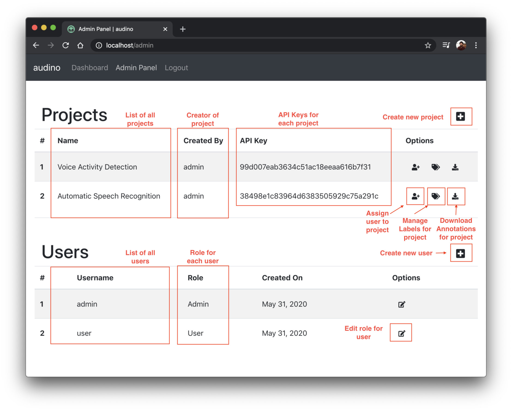

## Admin Dashboard

Here, an admin can [create new users](./creating-user.md), [assign and edit roles for users](./editing-role.md), [create new projects](./creating-project.md) and [assign projects to users](./manage-users-for-project.md). Each new project is assigned an API key to be used to [upload datapoints](./upload-data.md). Currently, we do not provide an option to upload audios through the dashboard.

