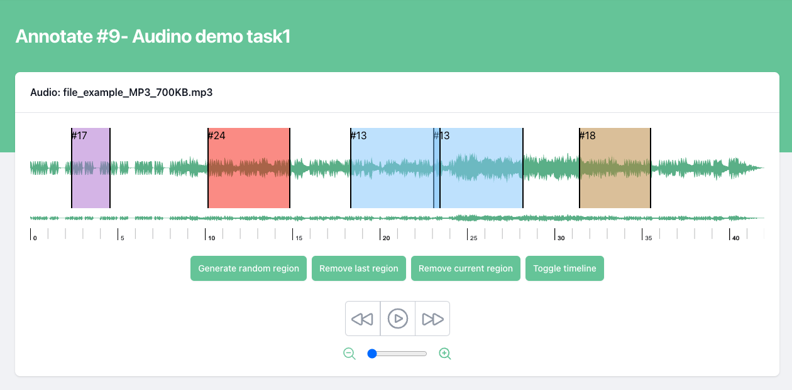

# Annotation

In this guide, we'll explain how user can annotate an audio. 

## List of tutorials

- [Create an annotation](#create-an-annotation)

## Create an annotation

To create a annotation, follow these steps:

- Open your web browser and navigate to jobs tab.
- Click on the job id
You will be redirected to annotation page where you can see a audio which need to be annotated and few buttons:

| Buttons             | Task                                                                |
| ----------------- | ------------------------------------------------------------------ |
| Generate random region |  It generates randomly a annotation region |
| Remove last region |  It removes the last region that has been created |
| Remove current region |  It removes the selected region |
| Toggle timeline |  It toggles timeline of audio |

Now, you can either click on "Generate random region" button or directly drag over audio to create a annotation region. 

After creating a region you will be asked to provide the following information to edit a region:

| Field             | Value                                                                |
| ----------------- | ------------------------------------------------------------------ |
| Segment transcription |  Add a transcription for that particular region |
| Label names |  Select the attribute value that suits the best for that region |

For saving the annotation object user need to click on "Save" button.