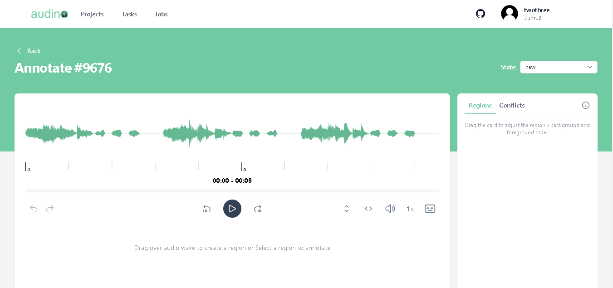
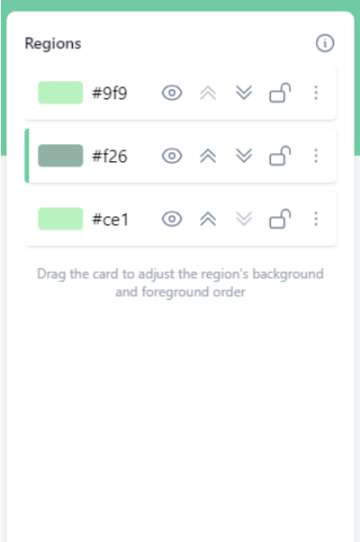

# Annotation

In this guide, we'll explain how user can create and download an audio. 

## List of tutorials

- [Create an annotation](#create-an-annotation)
- [Create an annotation using AI](#create-an-annotation-using-ai)

## Create an annotation

To create an annotation, follow these steps:

- Open your web browser and navigate to the jobs tab.
- Click on the job ID. You will be redirected to the annotation page where you can see an audio file that needs to be annotated and a few buttons:

| Buttons             | Task                                                                |
| ----------------- | ------------------------------------------------------------------ |
| 1 |  Change the state of annotation (new, in progress, completed, rejected) |
| 2 |  Undo button |
| 3 |  Redo button |
| 4 |  Skip 10sec backward |
| 5 | Play and pause the audio |
| 6 | Skip 10sec forward |
| 7 | Vertically zoom the audio wave |
| 8 | Horizontally zoom the audio wave |
| 9 | Change the volume |
| 10 | Speed of the audio file |
| 11 | Audino Shortcuts |

**Note:** To create any region, you can directly drag on the waveform and the region will be created.

- You can also drag and drop the regions, move them up and down, lock and unlock them, hide and show them, and by clicking on the three dots, you can also duplicate the regions.

After creating a region, you will be asked to provide the following information to edit the region:

| Field             | Value                                                                |
| ----------------- | ------------------------------------------------------------------ |
| Segment transcription |  Add a transcription for that particular region |
| Label names |  Select the attribute value that suits the best for that region |

For saving the annotation object, the user needs to click on the "Save" button.

## Create an annotation using AI
To create an automatic annotation using our AI model, follow these steps:

- Open Audino's portal and navigate to the jobs tab.
- Click on the three dots of a particular job. A modal will open. 

- Click on “Automatic annotation” to start the AI annotation.
