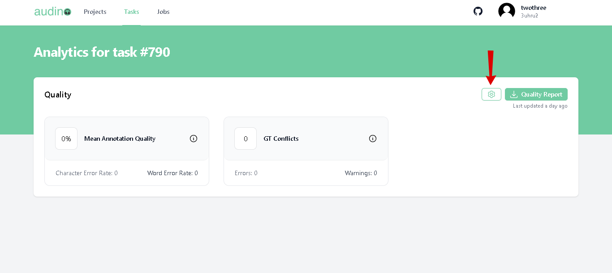
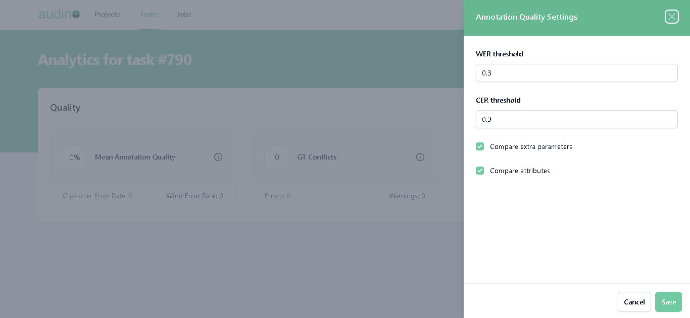

# Annotation Quality Settings

In this guide we'll show you if you need to tweak some aspects of comparisons, you can do this from the Annotation Quality Settings menu.

You can configure the word error rate (wer) threshold, character error rate (cer) threshold, compare extra parameters or not (emotion, locale, gender, etc), and compare attributes or not.The updated settings will take effect on the next quality update.

To open Annotation Quality Settings follow the steps:

- Find Quality report and on the right side of it, click on the setting icon inside the **Analytics of task** page.

- **Note:** If you find difficulty to find the Analytics of task page then click [here](./viewAnalytics.md)
- The following window will open after clicking on the setting icon.

- Annotation quality settings have the following parameters.

| Field             | Description                                                                |
| ----------------- | ------------------------------------------------------------------ |
|WER threshold  |  Min word error rate threshold is used for matching transcript.|
| CER threshold  | Min character error rate threshold is used for matching transcript. |
| Compare extra parameters | Enable or disable extra parameters checking (emotion, locale gender, etc) |
| Compare attributes | Enable or disable attribute comparison. |

