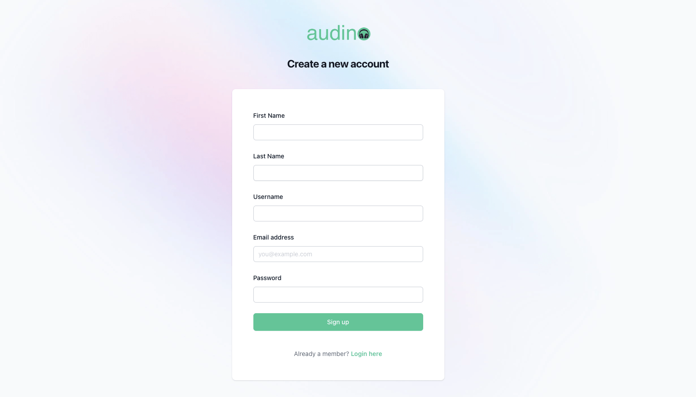
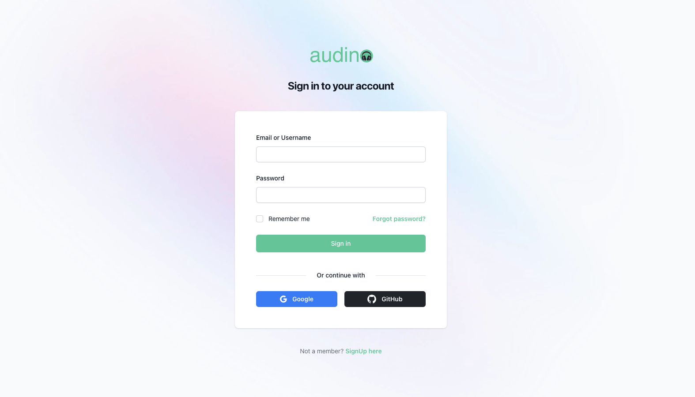

# Authentication

In this guide, we'll explain how user can login if they have account credentials otherwise user can create an account by filling few informations.
## List of tutorials

- Signup 
- Signin
## Signup

To create an account, follow these steps:

- Open your web browser and navigate to our website.
- Scroll down to the bottom of the page to find the "Sign Up here" button.
- Click on the "Sign Up here" button to start the registration process.

You will be asked to provide the following information to create your account:

| Field             | Value                                                                |
| ----------------- | ------------------------------------------------------------------ |
| First Name |  Enter your first name |
| Last Name |  Enter your last name  |
| Username |  Choose a unique username for your account |
| Email address | Provide a valid email address. This will be used for account notifications and password reset |
| Password | Create a secure password for your account. Make sure it's strong and not easily guessable |

Once you've entered all the required information, review it to ensure accuracy. Then, click the "Sign Up" button to complete the signup process.

After successful registration, you will be redirected to Sign in page, where you can fill your credentials and signin.
## Signin

If you have valid account credentials then you will have the option to enter either your username or email address and password is must.

Once you've entered your login information, review it to ensure accuracy. Then, click the "Sign In" button to complete the login process.

After successful login, you will be redirected to your account dashboard, where you can access your account settings and explore the project's features.