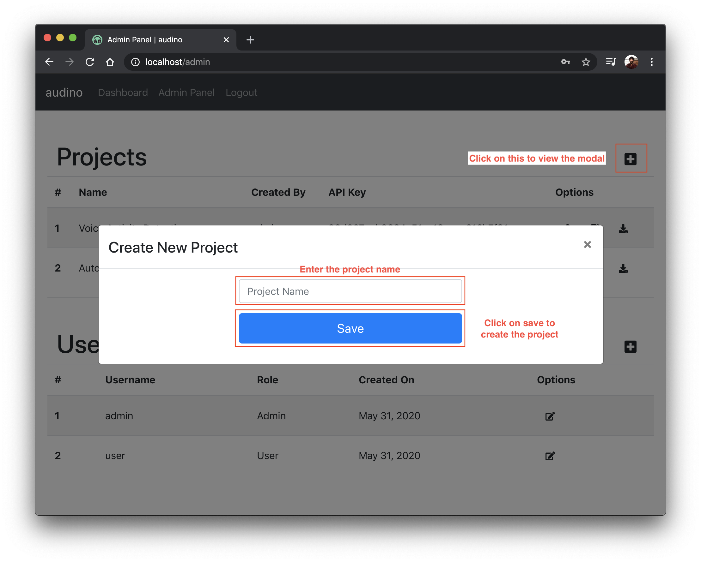

## Creating a new project

To create a new project, click on the `+` sign on the right of `Projects` table in [admin dashboard](./admin-dashboard.md). Fill in the required information (`project name`) and submit. A new project should be created.

