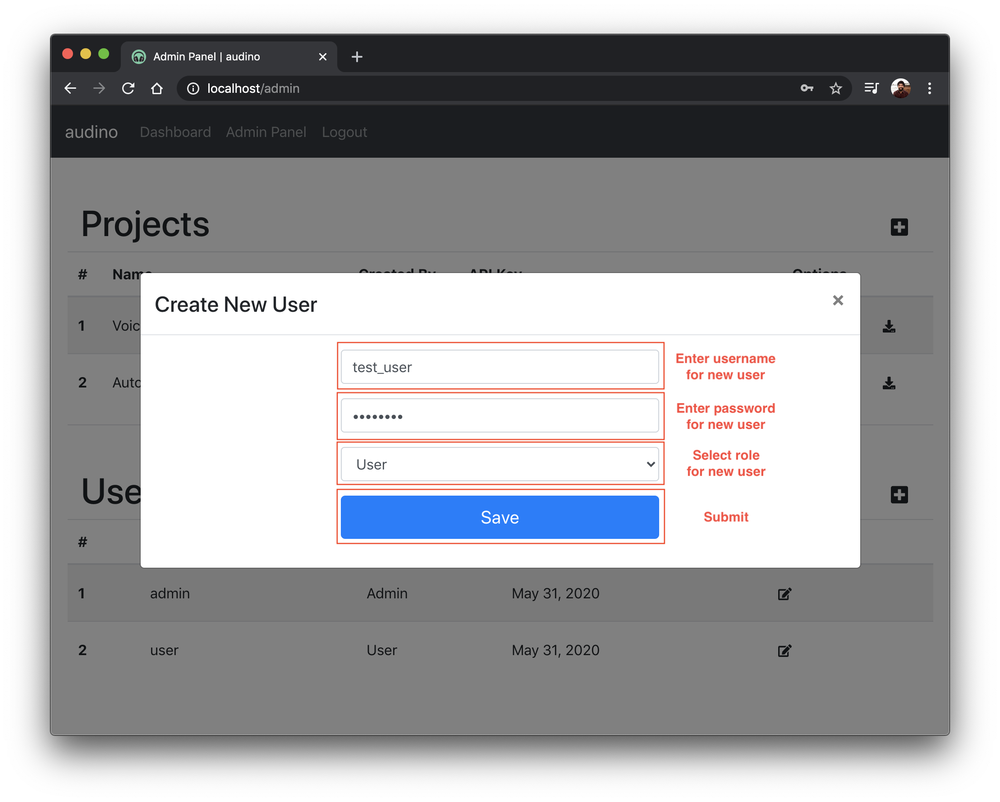

## Creating a new user

To create a new user, click on the `+` sign on the right of `Users` table in [admin dashboard](./admin-dashboard.md). Fill in the required information (`username`, `temporary password` and `role`) and submit. A new user should be created. Share the credentials with required person to get them started.

Currently, we don't provide an option for users to sign up themselves as it didn't fit in well to general workflow. This feature is up for discussion in issue created [here](https://github.com/midas-research/audino/issues/26).

