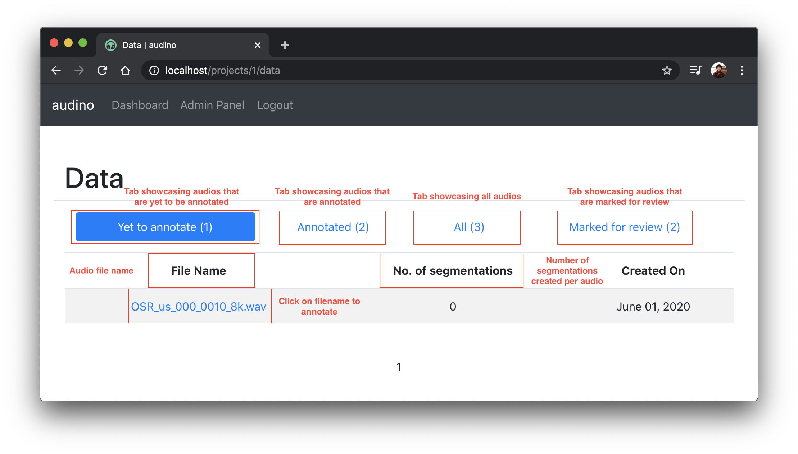

## Data Dashboard

This dashboard shows audio datapoints for a project that are assigned to a specific user and categorised under 4 tab headings.

1. `Yet to annotate`: Shows audios that are yet to be annotated by the user.
2. `Annotated`: Shows audios that have been annotated by the user.
3. `All`:  Shows all audios assigned to a user without any filtering.
4. `Marked for review`: Shows audios that annotator is unsure of and should be reviewed by a team member.

From here, user can click on any audio and go to [annotation dashboard](./annotation-dashboard.md) to annotate.

