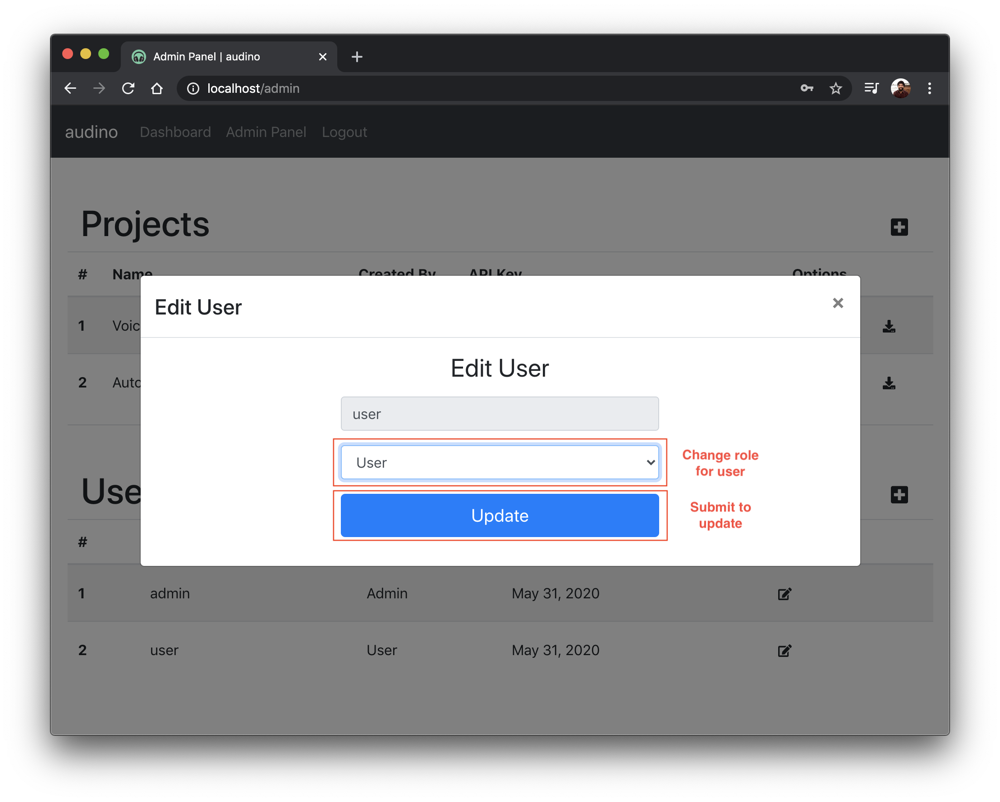

## Editing role

To change role of certain user, please click on `edit` option for the specific user in [admin dashboard](./admin-dashboard.md) and select role from the dropdown menu in the modal displayed. Click on `update` once changed.

