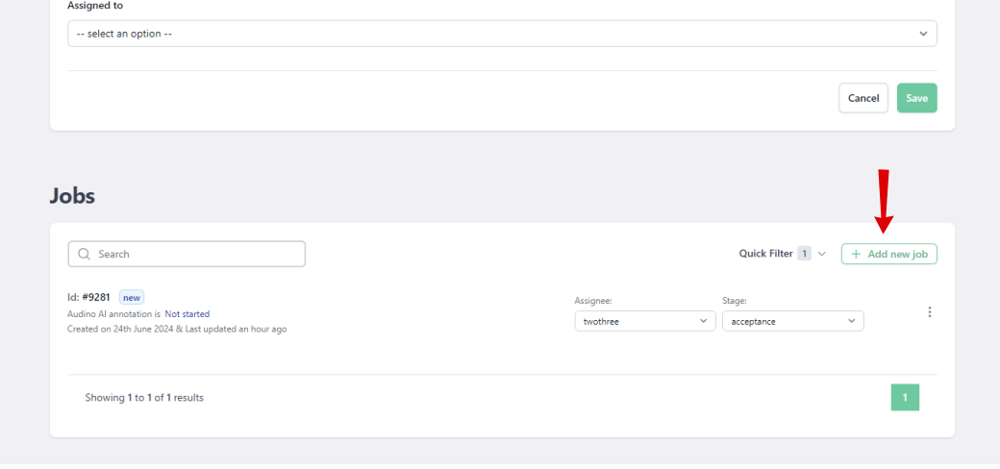
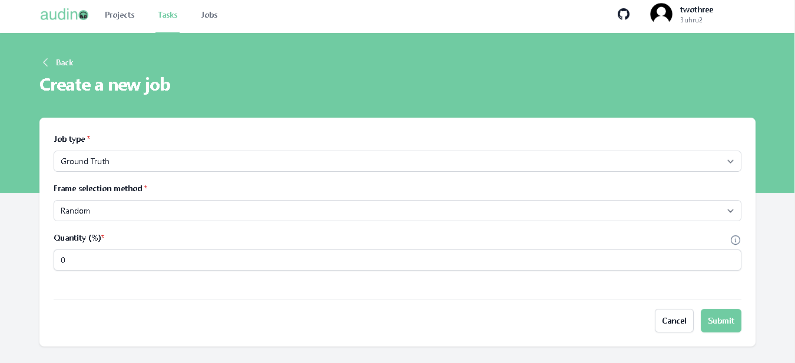
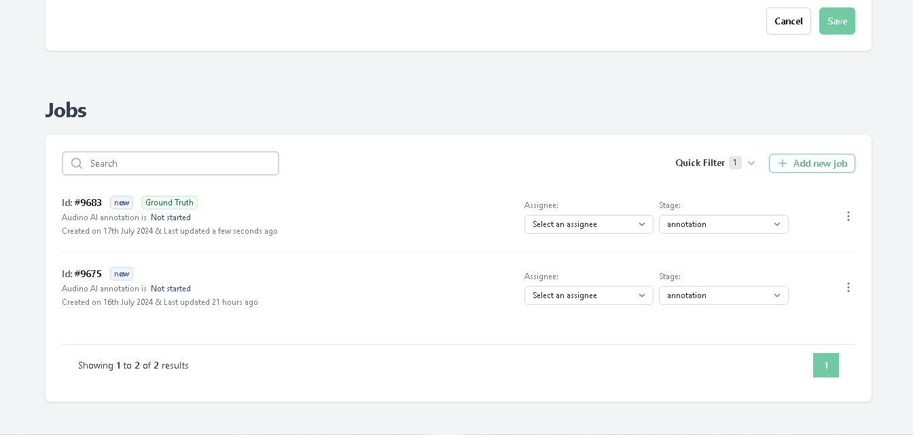
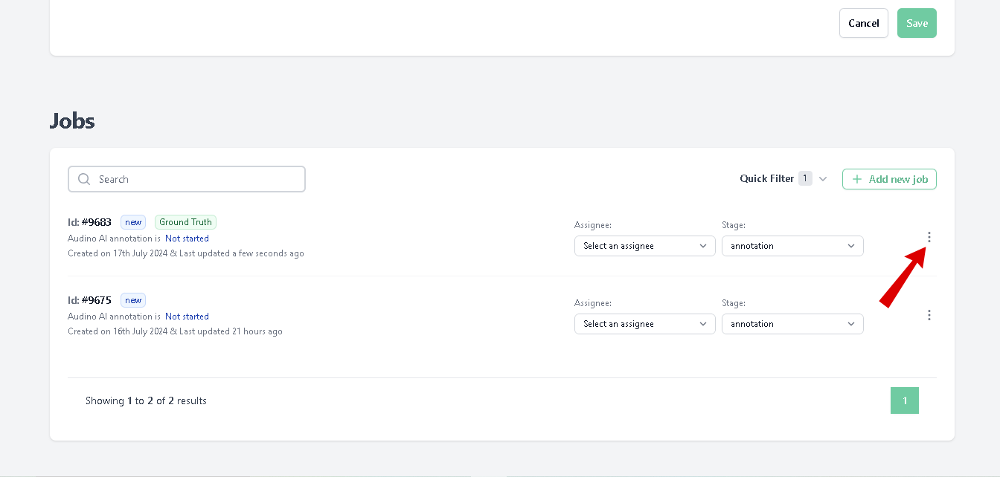
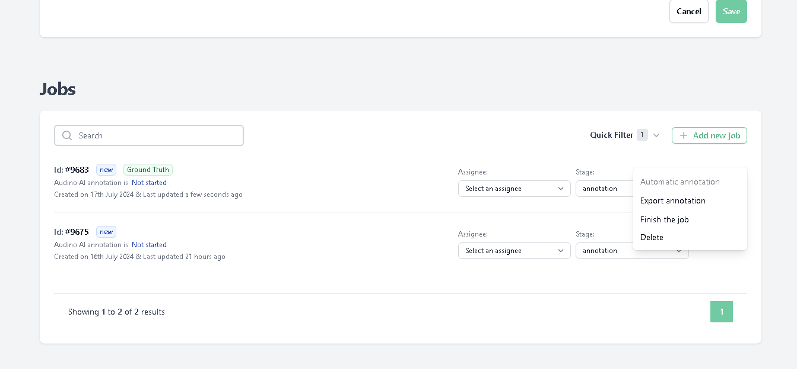
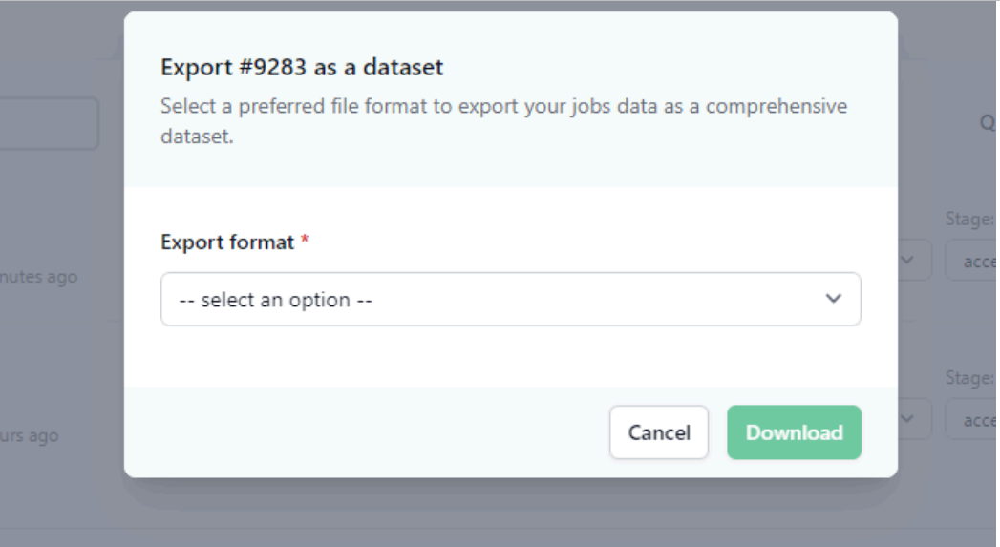
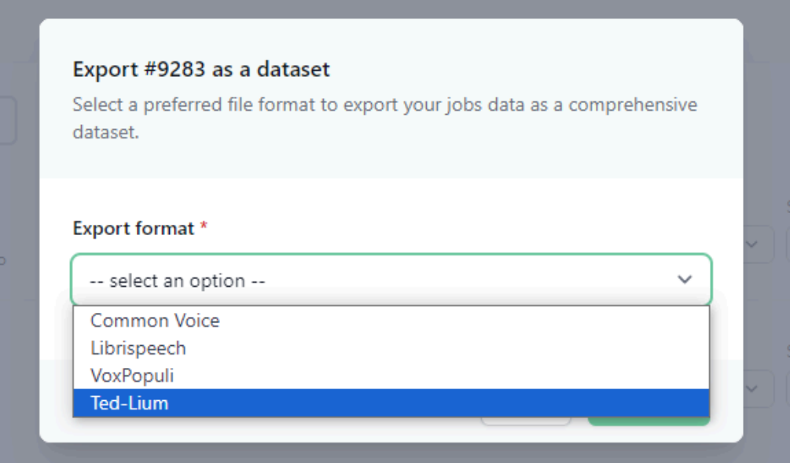
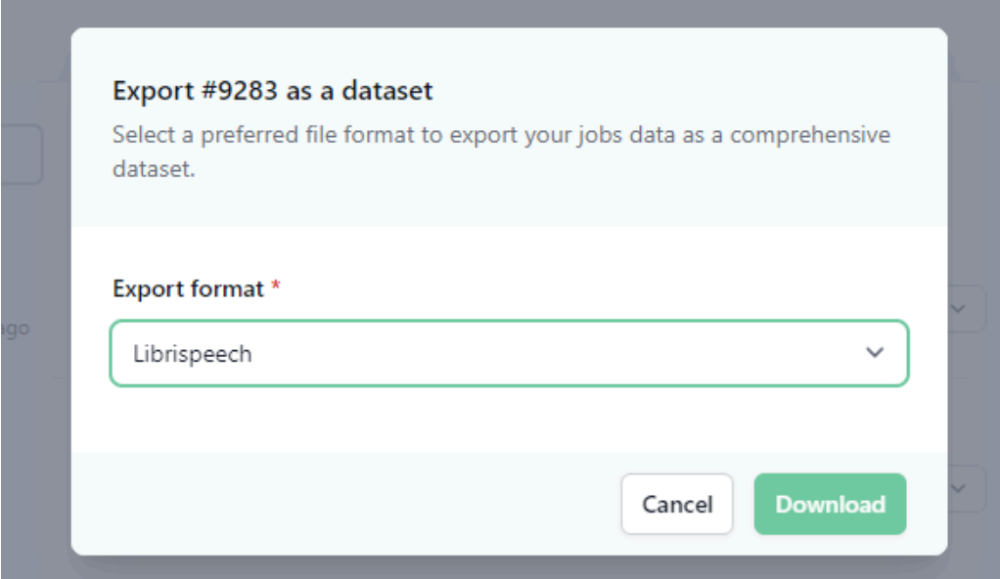

# Ground Truth Job
In this guide we will explain how users can create, Delete and Export ground truth job.

- A Ground truth job is a way to tell audino where to store and get the “correct” annotations for task quality estimation.
- To estimate task quality, you need to create a Ground truth job in the task and
annotate it. The job should be complete.
- Depending on the dataset size and task complexity, 5-15% of the data is typically
good enough for quality estimation

## List of tutorials

- [Create ground truth job](#create-ground-truth-job)
- [Delete ground truth job](#delete-ground-truth-job)
- [Export ground truth job](#export-ground-truth-job)

## Create ground truth job
To create a ground truth job do following:

- Navigate to the task tab in the navigation bar.

- Clicking on the Task tab you will be redirected to the Task page.

- Click on any task in which you want to create a ground truth job.
- After clicking on the task user will be redirected to the Update task page.
Scroll down below in the update task page user will see the job section in the update
task page.

- In the jobs section user will see an **Add new job** button.

- Click on the **Add New Job** button.Clicking on the **Add new job button** user will be redirect to the Create a new job page.

- User has to give the following information in this page to create a new job.

| Field             | Value                                                                |
| ----------------- | ------------------------------------------------------------------ |
|Job type |  Select the job type as ground truth.  |
| Frame selection method   | Give the frame selection method by default it is random. |
| Quantity | Give the quantity.The ideal quantity is between 5 to 15% |

- Click on the submit button.
- After submitting user will redirected to the update task page again where the user will
see their jobs of ground truth.

## Delete ground truth job
To delete ground truth job follow the steps:
- Go to the ground truth job.

- Click on the 3 dots button of the ground truth job.

- A modal will open like this.

- Click on the delete in the modal.
- You will be asked to provide the confirmation (yes or no).Once you click yes button the the ground truth job is permanantly deleted.

## Export ground truth job
To export the ground truth job follow the steps:
- Go to the ground truth job.
- Click on the three dots.
- After clicking on the 3 dots button in the ground truth job a modal will open.

- Click on the export annotation in the modal. After clicking a popup will open.

- Select the format in the options in which you want to export the file.

- After selecting the format click on the download button in the popup.Clicking on the download button will download your job.

