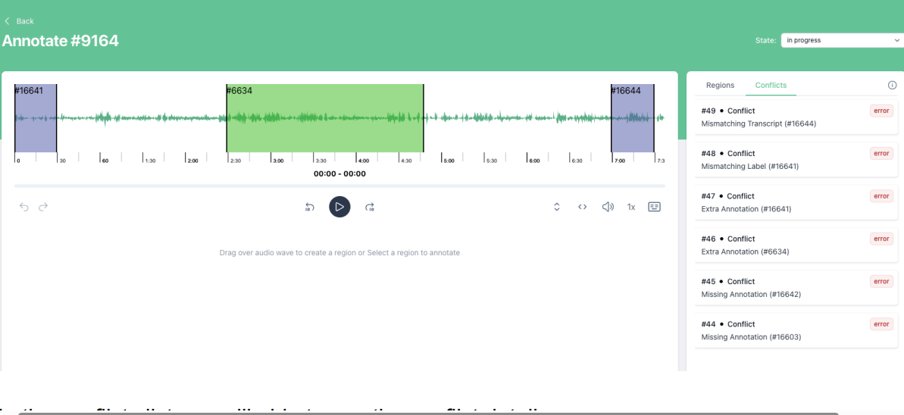
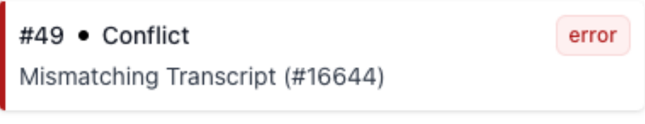

# GT Conflicts in Audino Interface

In this guide we will show you how you can see the GT conflicts in the audino interface while annotating.

**Note:** If you having difficulty on going to the annotation page then click [here](./annotation.md) and follow only two points under the create an annotation.

To see GT Conflicts in the Audino interface, go to conflicts tab on right side

In the conflicts list you will able to see the following conflict detail.

- Conflict type (error or warning)
- Conflict id #49
- Annotation id #16644
- Name of the conflict (Mismatching Transcript)