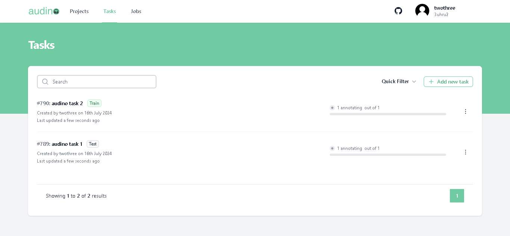
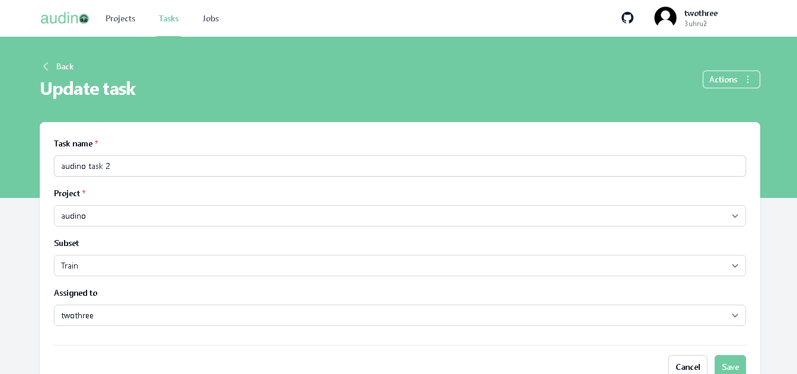
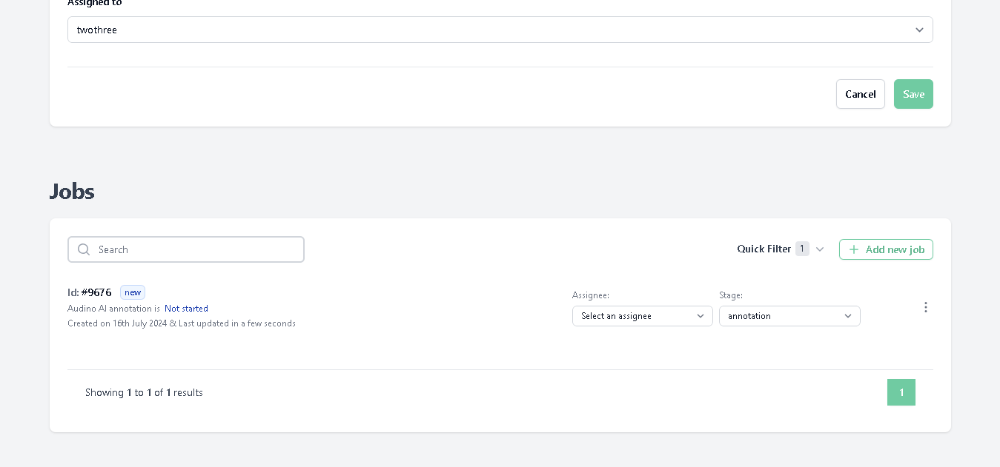

# Jobs

In this guide, we'll explain about Jobs. In our annotation tool Job is automatically created when a task is being created. A task can have multiple jobs but can have only one ground truth job.

To go to any job of the particular task follow the steps:

- Navigate to the task in the navigation bar.

- After clicking on the task you will be redirect to the task page.
- **Note:** If you haven't created any task earlier click [here](./tasks.md)

- Click on the task in which you want to see the created job. After clicking you will be redirect to the update task page.

- Scroll down below you can see the created jobs of the particular task.

**Note:** You can also create the **Ground Truth** job , to know more about the ground truth job click [here](./groundTruthJob.md)

