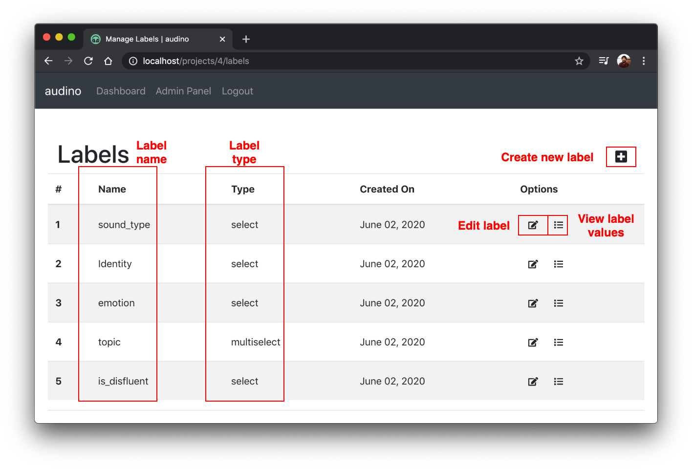

## Label Dashboard

Label dashboard shows all labels associated with a project. To create a new label, click on the `+` sign on the right of `Label` table. You would need to select label type and enter label name. Label types can be of one of two types: `select` and `multiselect`.

1. `select`: Only one option can be selected for a label.
2. `multiselect`: Multiple options can be selected for a label.

You can edit label type using the `Edit label` option. You can also view the label values using [`Label Values`](./manage-label-values-for-labels.md) option.

