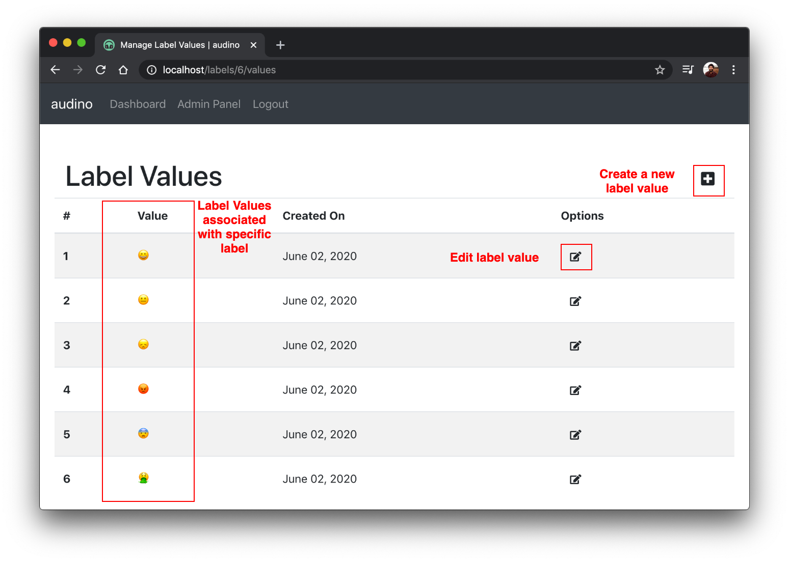

## Manage label values for labels

For each label, you need to add values associated with them.

To create a new label value, click on the `+` sign on the right of `Label Values` table. Fill in the required information (`label value`) and submit. A new label value should be created.

To edit a label value, click on `edit` option. A modal should open where label value can be edited.

