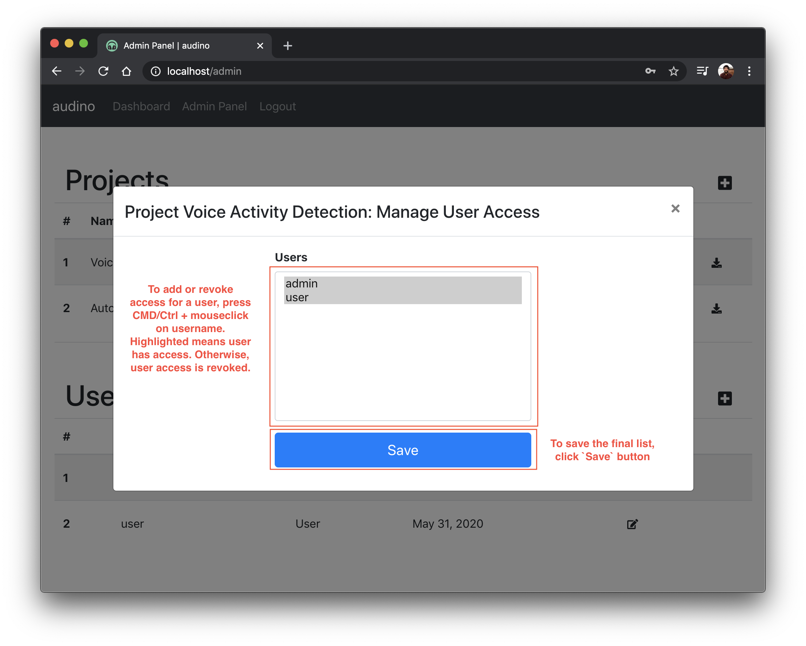

## Managing users for a project

After [creating users](./creating-user.md) and [project](./creating-project.md), you would need to add users to a projects so that they can be [assigned data](./upload-data.md) to annotate. To proceed, click on `Manage Users` icon under options for a specific project. This can be found on [admin dashboard](./admin-dashboard.md). A modal should open containing list of all users. To select a user, press `CMD/Ctrl` and click on a username to add or revoke access. Highlighted means user has access.

