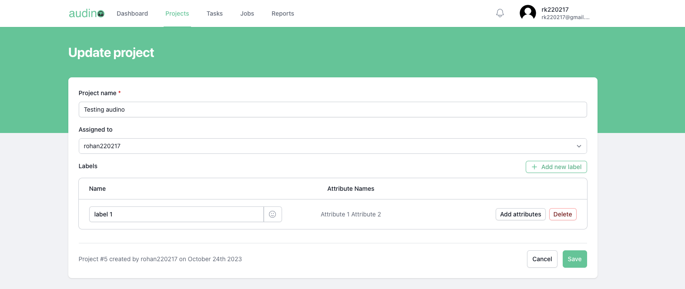

# Projects

In this guide, we'll explain how user can create, edit, delete projects. In our Annotation tool Projects refer to a collection of labels which can we imported while creating an Annotation task.
## List of tutorials

- [Create a project](#create-a-project)
- [Edit a project](#edit-a-project)
- [Delete a project](#delete-a-project)

## Create a project

To create a project, follow these steps:

- Open your web browser and navigate to projects tab.

- Click on the card "Get started by creating a new project".

You will be asked to provide the following information to create a project:

| Field             | Value                                                                |
| ----------------- | ------------------------------------------------------------------ |
| Project Name |  Enter your project name |
| Assigned to |  Select a user whom you want to assign this project  |
| Labels |  Create labels for the project |

Once you've entered all the required information. Then, click the "Save" button to complete the creating process.

After successful create, you will be redirected to projects page, where you can find your newly created project.

## Edit a project

To edit a project, follow these steps:

- Open your web browser and navigate to projects tab.

- Click on the pencil icon of a particular project whom you want to edit.

You will be asked to provide the following information to edit a project:

| Field             | Value                                                                |
| ----------------- | ------------------------------------------------------------------ |
| Project Name |  Edit your project name |
| Assigned to |  Select a user whom you want to assign this project  |
| Labels |  Create/Edit labels for the project |

Once you've entered all the required information. Then, click the "Save" button to complete the editing process.

After successful edit, you will be redirected to projects page.

## Delete a project

To delete a project, follow these steps:

- Open your web browser and navigate to projects tab.

- Click on the dustbin icon of a particular project whom you want to delete.

You will be asked to provide the confirmation (yes or no). Once you click yes button the project is permanantly deleted. 