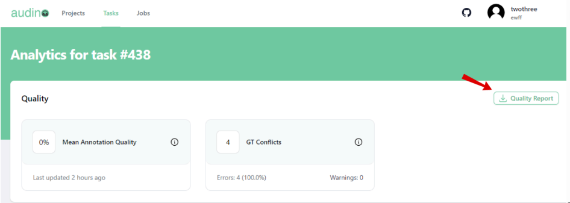

# Quality Report
In this guide we'll explain how user can download the quality report of the task.

To download the quality report of the task do following:

- Go to the **Analytics of task** page.
- **Note:** If having problem on going to the **Analytics of task** page then click [here](./viewAnalytics.md)
- Click on the Quality report button in the top right corner of the **Analytics of task** page.

Clicking on the qualty report button will download the quality report in the JSON format.
