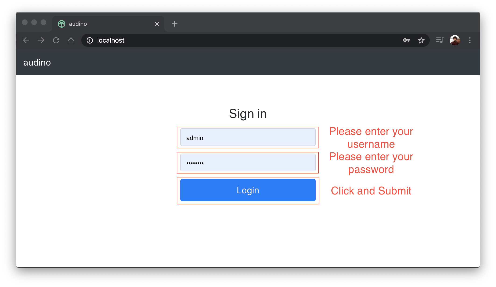

## Signing In

Based on the credentials shared in `docker-compose` file, an admin account is created. If you're signing in for the first time, please use these credentials. Once logged in, you will view the [user dashboard](./user-dashboard.md).

