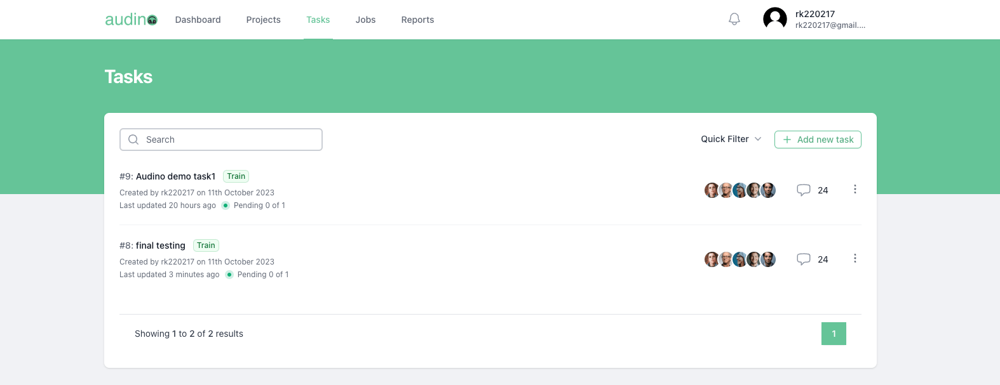

# Tasks

In this guide, we'll explain how user can create, edit, delete tasks. In our Annotation tool Tasks refer to a dataset user can directly import all the labels from previously created projects and add audio data.

## List of tutorials

- [Create a task](#create-a-task)
- [Edit a task](#edit-a-task)
- [Delete a task](#delete-a-task)

## Create a task

To create a task, follow these steps:

- Open your web browser and navigate to tasks tab.

- Click on the "Add new task" button.

You will be asked to provide the following information to create a task:

| Field             | Value                                                                |
| ----------------- | ------------------------------------------------------------------ |
| Task Name |  Enter your task name |
| Project|  Select a project to import all the labels in it |
| Subset |  Select a subset according to the requirements |
| Assigned to |  Select a user whom you want to assign this task 
| Select files |  Upload the audio data |

Once you've entered all the required information. Then, click the "Save" button to complete the creating process.

After successful create, you will be redirected to tasks page, where you can find your newly created task.

## Edit a task

To edit a task, follow these steps:

- Open your web browser and navigate to tasks tab.

- Click on the three dot button of a particular task.

- Select "Edit" button

You will be asked to provide the following information to create a task:

| Field             | Value                                                                |
| ----------------- | ------------------------------------------------------------------ |
| Task Name |  Edit your task name |
| Project|  Select a project to import all the labels in it |
| Subset |  Select a subset according to the requirements |
| Assigned to |  Select a user whom you want to assign this task 

Once you've entered all the required information. Then, click the "Save" button to complete the creating process.

After successful edit, you will be redirected to tasks page.

## Delete a task

To delete a task, follow these steps:

- Open your web browser and navigate to tasks tab.

- Click on the three dot button of a particular task.

- Select "Delete" button

You will be asked to provide the confirmation (yes or no). Once you click yes button the task is permanantly deleted. 