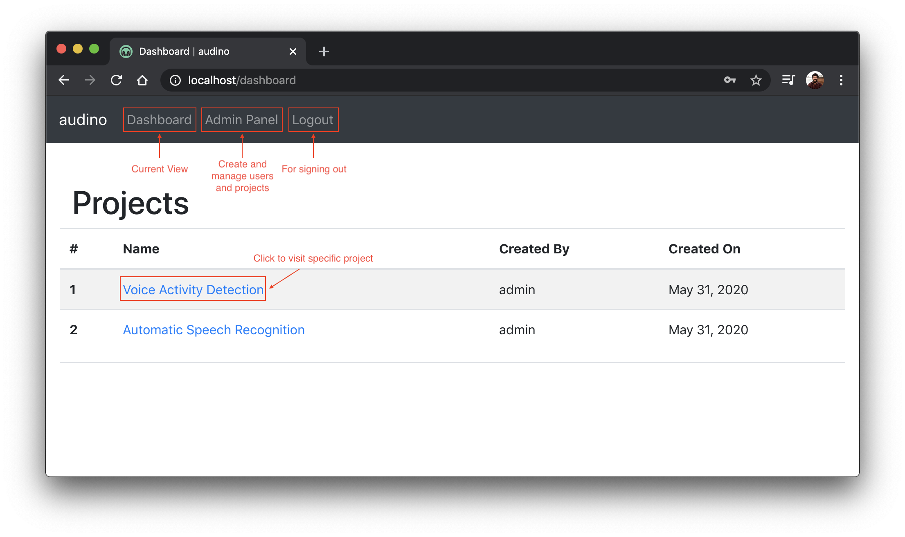

## User Dashboard

Here, a user will be able to view the assigned projects. An admin can view all projects. The user can also view top navbar options which can help in navigation. The user can go to [admin dashboard](./admin-dashboard.md), logout or go back to the user dashboard. A user can also visit [project specific dashboard](./data-dashboard.md) to view the datapoints to be annotated.

