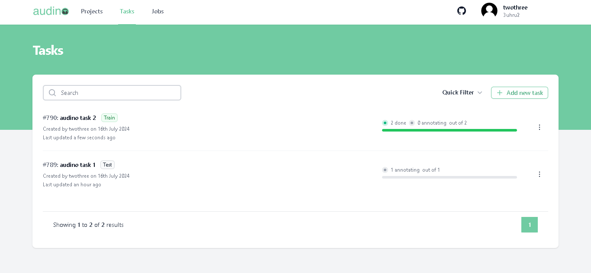
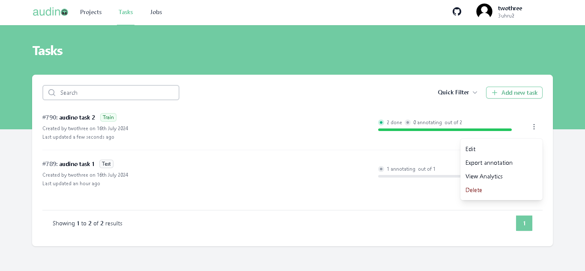
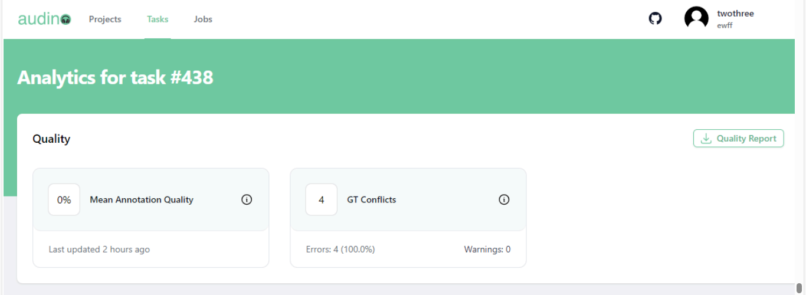
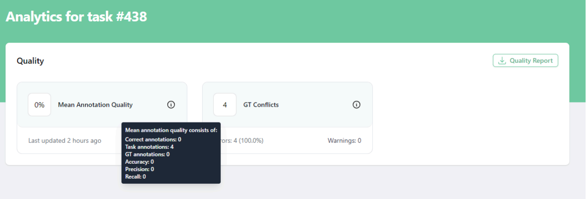

# View Analytics
In this guide we'll explain how user can view analytics of ground truth job.

Once you’ve established the Ground truth job, proceed to annotate the dataset.
Audino will begin the quality comparison between the annotated task and the Ground truth
job in this task once it is finished (on the acceptance stage and in the completed state).

**Note:** if you haven't created  **Ground Truth** job earlier then click [here](./groundTruthJob.md).

To view anaytics of ground truth job do following steps : 

- Open your web browser and navigate to tasks tab.

- After navigating the task user will redirect to the task page.

- Click on the 3 dots button of the particular task in which you selected the
state as completed in the ground truth job.
- After clicking on the 3 dots button a modal will open.

- Clicking on the view analytics in the modal will open the analytics of the task page.
- **Note**: The quality calculation process may take up to several hours, depending on the
amount of data and labeled objects, and it is not updated immediately after task updates.

Users will see the following information in analytics.

| Field             | Description                                                                |
| ----------------- | ------------------------------------------------------------------ |
|Mean annotation quality |  Displays the average quality of annotations, which includes: the count of accurate annotations, total task annotations, ground truth annotations, accuracy rate, precision rate, and recall rate.
| GT Conflicts  |  Select a user whom you want to assign this project Conflicts identified during quality assessment, including extra or missing annotations. Mouse over the i icon for a detailedconflict report on your dataset. |

Mouse over the ⓘ icon you can see more information.

